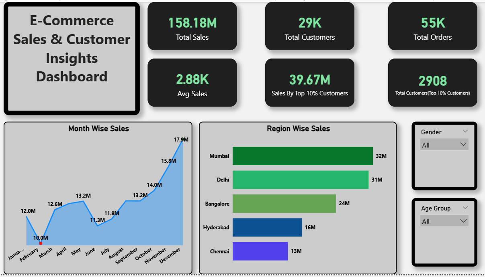
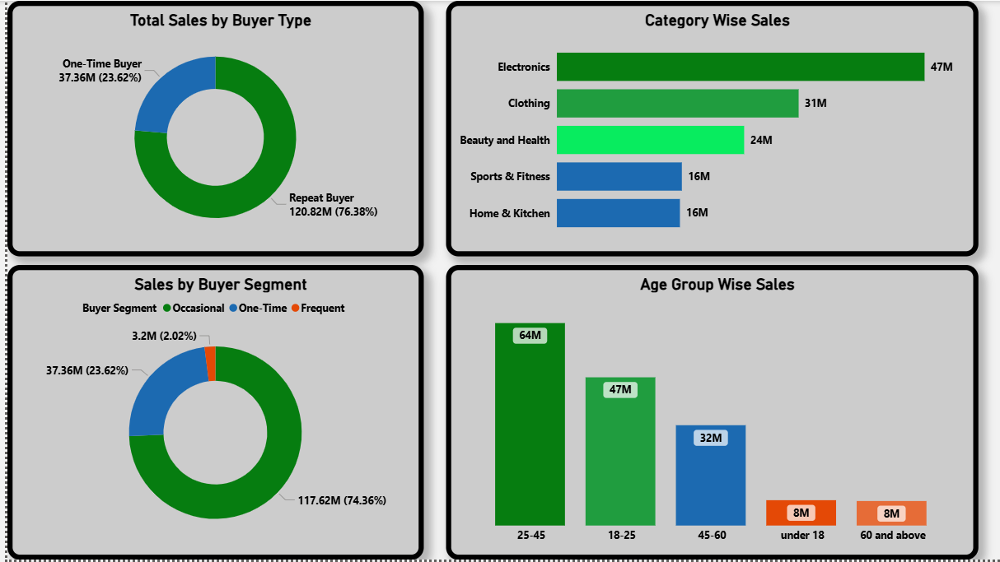
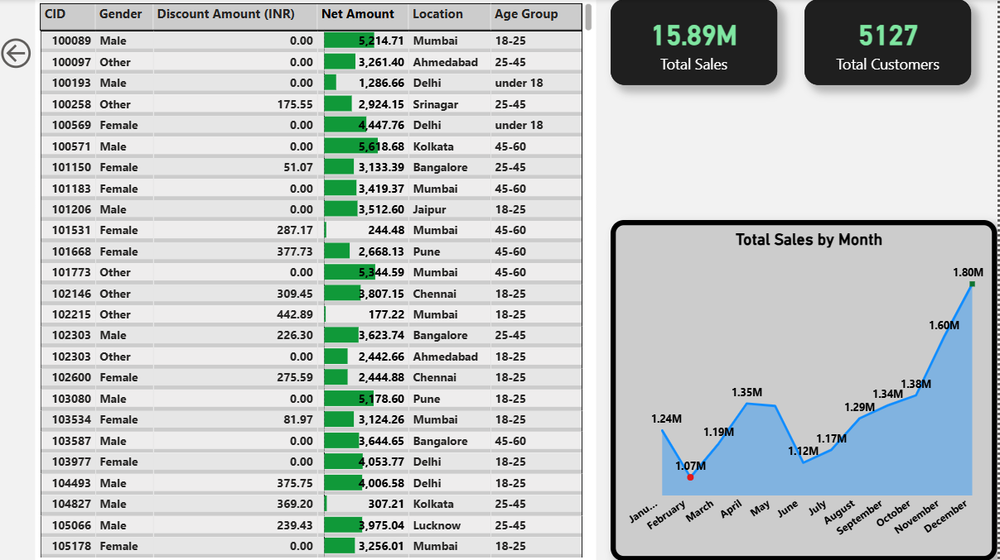

# 🛒 E-Commerce Sales & Customer Analysis


---

## 📌 Project Description
This project analyzes an e-commerce company’s transactional data to understand **sales performance, customer behavior, and revenue drivers**.

Using **Python, SQL, and Power BI**, the project combines data analysis, statistical testing, and interactive dashboards to generate **actionable business insights**.

---

## 📂 Dataset
- 55,000+ e-commerce transactions  
- Customer, product, pricing, and location data  

**Source:**  
https://www.kaggle.com/datasets/shrishtimanja/ecommerce-dataset-for-data-analysis

---

## 🎯 Business Objective
- Increase revenue  
- Improve customer retention  
- Identify high-value customers  
- Optimize product and marketing strategies  

---

## 🛠️ Tools & Technologies
- Python (Pandas, NumPy, SciPy)  
- SQL (MySQL)  
- Power BI  

---

## 📊 Key Insights

- **Total Sales:** ~15.8 Crores  
- **Top Categories:** Electronics, Clothing, Beauty & Health (~65%)  
- **Top 10% Customers:** Contribute ~25% revenue  
- **Repeat Buyers:** Contribute ~76% revenue  
- **Top Cities:** Mumbai, Delhi, Bangalore (~55% revenue)  
- **Discount Impact:** Statistically significant (p < 0.05)  
- **Peak Season:** November–December  

---

## 💡 Business Recommendations

- Focus on high-performing categories  
- Retain high-value and repeat customers  
- Use targeted discounts instead of blanket offers  
- Focus marketing on metro cities and 25–45 age group  
- Increase inventory before festive season  

---

## 📸 Dashboard Screenshots

### Sales Overview


### Sales Analysis


### Drillthrough Analysis


### Insights & Recommendations


---

## ⚙️ How to Run

```bash
git clone https://github.com/vishaldataanalyst/Ecommerce-Sales-Customer-Analysis.git

- Download dataset from Kaggle

- Open Python notebook → run analysis

- Run SQL queries

- Open Power BI dashboard (.pbix)

---

## 📁 Project Structure

Ecommerce-Sales-Customer-Analysis/
├─ Python/
├─ SQL/
├─ Power Bi/
├─ Screenshots/
└─ README.md
